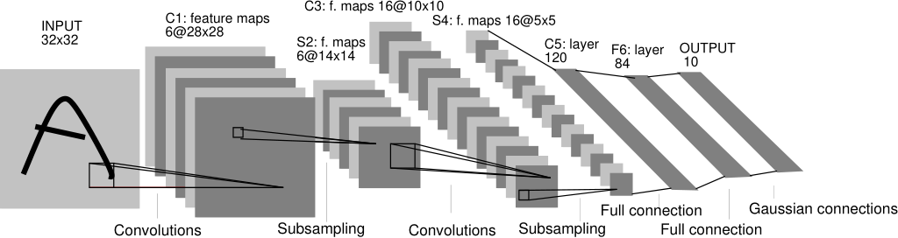

<h1> CNN </h1>

Learn by reading the classic CNN-related paper: <em>Gradient-Based Learning Applied to Document Recognition</em>
1. The key points in <em>Gradient-Based Learning Applied to Document Recognition</em>
    * Problem: Neural networks need to respond similarly to detecting objects in different positions or proportions in the image to improve the accuracy of the neural network in recognizing content in the image.
    * The authors dealt with this problem by creating a neural network called LeNet-5.
    
    * The neural network are able to extract visual features such as edges, corners, etc., which are combined in the next layer to form higher level features, as mentioned before, deformation and displacement cause changes in the location of salient features, in addition, feature detectors localized in the image can also be used for the whole image, based on this property, we can set a set of neurons with local receptive fields located at different locations in the image to have the same weights.
    * All neurons in each layer form a plane in which all neurons share weights. All the outputs of the neural networks form a feature map, in which all the units perform the same operation at different locations in the image, so that they can detect the same features at different locations in the input image. A complete convolutional layer consists of multiple feature maps (using different weight vectors), so that multiple features can be extracted at each location.
    * Shift, scale, and distortion invariance is achieved through local receptive fields, shared weights, and sub-sampling.

2. PoseCNN
    * 6D Pose: 3D position and 3D orientation of object coordinate system in camera coordinate system
    * PoseCNN propose an end-to-end 6D pose estimation network PoseCNN with strong robustness to inter-target occlusion.
    