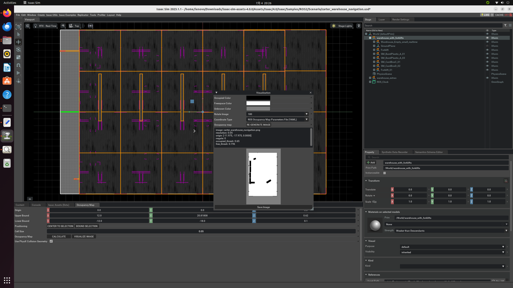

# Week 3 Report

### ROS 2 installation
- Finish installing ROS 2 in ubuntu 22.04
- Workspaces must be set up before launching Bridge extension:
     1. Clone the ROS Workspace Repository with this command:
  ```shell
  git clone https://github.com/isaac-sim/IsaacSim-ros_workspaces
  ```
- Finally, enable the ROS Bridge Extension after setting workspace.


### ROS2 Navigation:
  - Finish installing Nav2
  - Use the Occupancy Map Generator extension to generate an occupancy map of the warehouse environment

  [](https://docs.omniverse.nvidia.com/isaacsim/latest/ros2_tutorials/tutorial_ros2_navigation.html)

